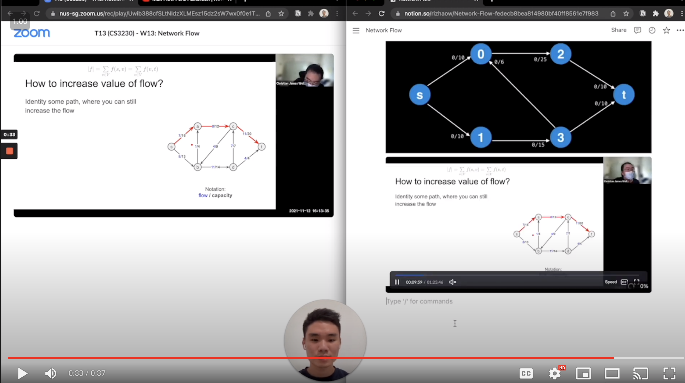

# SideNotion: Turn Notion into your online lecture sidekick

## How to use?

## How to install?

### Latest Version

This repository will always be the latest version.

1. Download this repository
2. Load unpacked the folder in chrome://extensions page

[Step by step video tutorial](https://www.loom.com/share/00aaee56a5fc4548a8143811c91827c5)

### Chrome Extension Store

> Note the version may not be the latest one (Have to wait for chrome moderators to approve)

Download it here

https://chrome.google.com/webstore/detail/sidenotion/ihjmeedcmbeapmaagcjpngemnckiooih

# Appendix

- Blog: https://30apps.me/build-01-sidenotion
- #1 Product of the day on ProductHunt: https://www.producthunt.com/posts/sidenotion
- Part of the [30 apps in 30 days project](https://www.30apps.me)

## How to package to Chrome Web Store?

1. Choose all files and folders except for `misc`, `package.json` and `package-lock.json`
2. Compress the chosen files and folders
3. Rename the zip file to the version number and move it to misc/packages
4. Upload the zip file to Chrome Web Store

**Want to build SideNotion together?**

- Contact me on Telegram [t.me/rizhaow](https://t.me/rizhaow)
